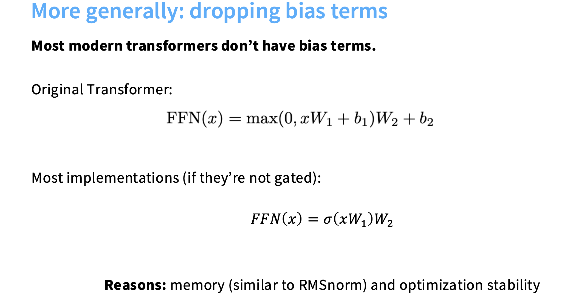
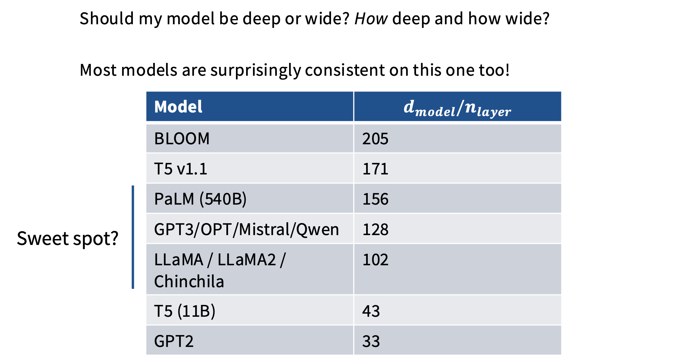

#  Lec3: Architectures, Hyperparameters

## Architectures

### Pre norm

为什么Transformer中的预规范的效果更好？

Transformer 中使用预规范（Pre-Norm）效果更好，是因为它保留了残差路径的恒等梯度流，避免 LayerNorm 干扰梯度，避免了深层模型的梯度消失和优化不稳定问题，从而显著提高了深层模型的训练稳定性。

### RMS Norm

RMS Norm的效果和Layer Nrom一样好，但是训练速度更快？

* FLOPs, Memory movement更少。
* 不去掉bias可以最大程度上的稳定训练。
  * Transformer 的残差块：$x_{l + 1} = x_l + \text{Sublayer}(\text{Norm}(x_l))$。LayerNorm 的“去均值”操作会改变残差路径的统计特性，使得残差项和输入不完全对齐。换成RMS Norm，使残差部分$x_l$与输入保持更高的一致性，这样梯度就能更平稳地传递，不容易梯度爆炸或消失。

norm的作用：不让数据在规模上漂移。

### FFN without bias

不用bias，内存操作更少，且更加稳定训练。

### Activations

#### common activation

#### Gated Activation

让模型更灵活地控制信息流动，网络能学会“哪些要保留多，哪些要抑制一点”。用于第一个FFN之后，第二个FFN之前。

Do gated linear units work?

Yes, fairly consistently so.

GLU isn’t necessary for a good model (see GPT3), but it’s probably helpful.

But evidence points towards somewhat consistent gains from Swi/GeGLU.

Note: Gated models use smaller dimensions for the $d_{ff}$ by 2/3。

### Serial vs Parallel layers

分别对x做MLP和Attention，然后求和。

但是Serial的表达拟合能力更强。

### Positinal encoding: RoPE

Converge to RoPE embedding！

内积对任意的旋转都不变，相对位置得到保留。在attention层的q和k调用。

### Summary

## Hyperparameters

### $d_{ff} = 4 \times d_{model}$

对于Gated Activations来说，$d_{ff} = \frac{8}{3} \times d_{model}$。

### $d_{model} / (d_{head} \times n_{head}) = 1.$

当头的数量过多，每个头的size过小，捕捉上下文依赖的能力就没那么好。

### Aspect ratios: $d_{model} / n_{layer} $

### vocabulary size

### 正则化：dropout, weight decay

LLM训练时weight decay的作用？

* 它通过与学习率 schedule 的相互作用，维持权重分布的平衡与训练稳定性。
* 适度的 weight decay（通常 λ≈0.1）能让模型在学习率衰减阶段继续高效学习。

为什么dropout不再流行？

* LLM的参数量巨大，已经不再存在过拟合问题了。
* Dropout 会干扰梯度稳定性和收敛速度，不能减少训练损失。

中图是快速学习率衰减：

- 在高学习率阶段，weight decay 几乎没影响；
- 在学习率衰减后，过强的 weight decay 会“过度拉小”参数，导致学习停滞；
- 适度的 weight decay（如 0.1）最平衡。

右图是恒定学习率：

* 在固定学习率下，weight decay 起到稳定训练、抑制参数膨胀的作用；
* 但过大时，会直接阻碍优化，使模型收敛更慢。

## z-loss

防止softmax过程中的梯度消失/爆炸问题。

## QK norm

Attention softmax stability

对 $Q$ 矩阵和 $K$ 矩阵做归一化。

 ## MQA / GQA

Saving inference costs by reducing the number of heads，解决KV cache爆炸的问题。

### MQA：Multi-Query Attention（多查询注意力）

优点：

- KV 只保存一份 → 显存减少约head 数倍；
- 推理更快（缓存更小，矩阵乘法更集中）；

缺点：

- 因为所有 heads 共用 K/V，表示能力略有下降；
- 对极复杂任务或长上下文可能略微退化。

### GQA：Grouped-Query Attention（分组查询注意力）

将多个 query heads 分成若干组，每组共享一组 K/V。

例如：

- 共有 16 个 query heads；
- 分成 4 组；
- 每组共享同一对 $K, V$。

这样：

- KV 存储减少4 倍；
- 保留了一定的多样性（每组仍独立）；
- 效果几乎与完整 MHA 一致。

### 实验结果

## Sparse attention

降低注意力计算的复杂度，从 $O(n^2)$ 降到近似线性。

## Sliding window attention

