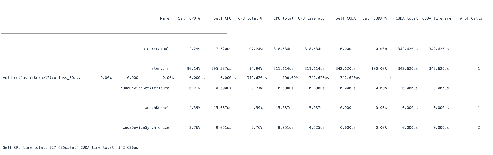
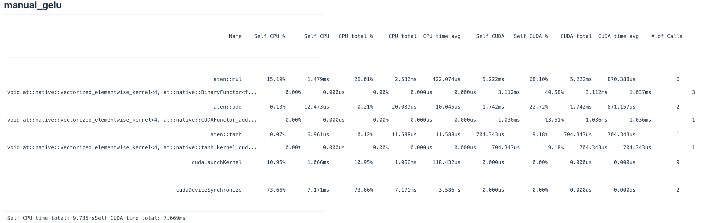
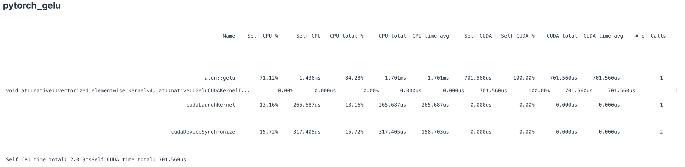
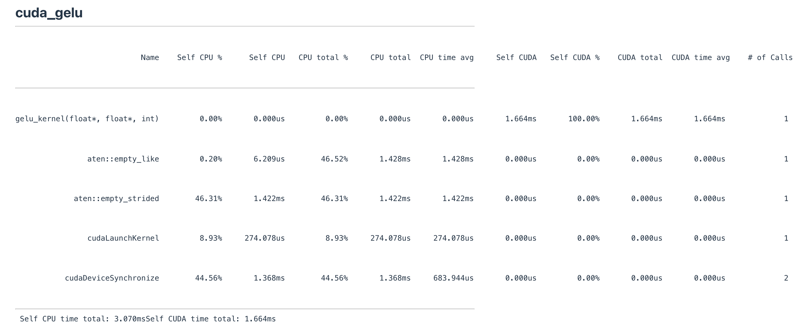
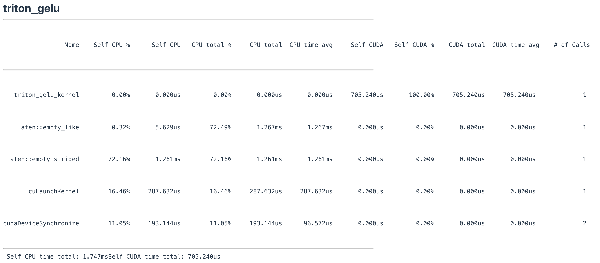
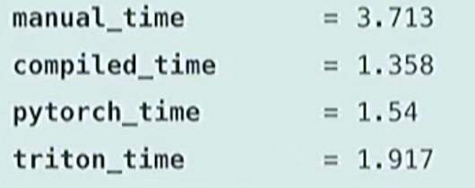
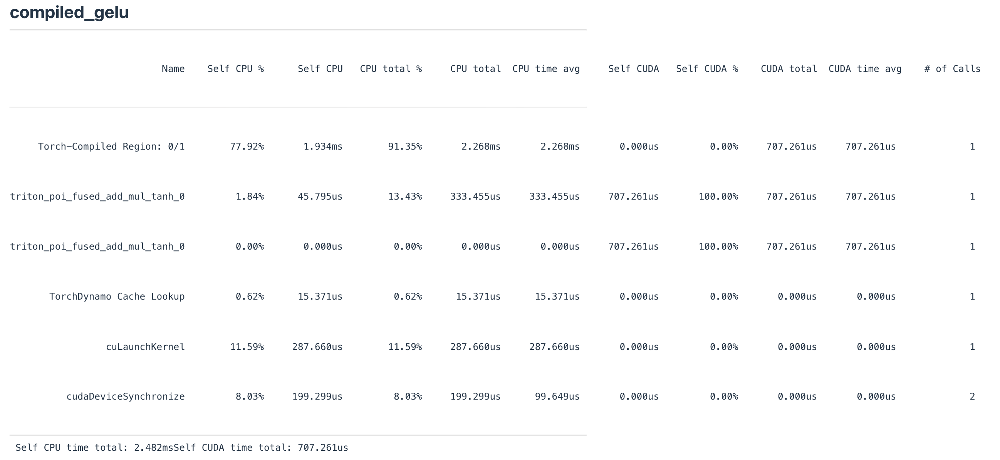
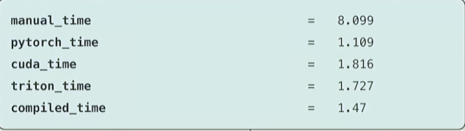

# Lecture6: Kernels, Triton

学习为GPU编写高性能代码。

## benchmarking and profiling

### benchmarking

基准测试和性能分析，总共花费多少时间/时间被用在哪些地方。找到瓶颈模块

```python
def benchmark(description: str, run: Callable, num_warmups: int = 1, num_trials: int = 3):
    """Benchmark `func` by running it `num_trials`, and return all the times."""
    # Warmup: first times might be slower due to compilation, things not cached.
    # Since we will run the kernel multiple times, the timing that matters is steady state.
    for _ in range(num_warmups):
        run()
    if torch.cuda.is_available():
        torch.cuda.synchronize()  # Wait for CUDA threads to finish (important!)
    # Time it for real now!
    times: list[float] = [] # @inspect times, @inspect description
    for trial in range(num_trials):  # Do it multiple times to capture variance
        start_time = time.time()
        run()  # Actually perform computation
        if torch.cuda.is_available():
            torch.cuda.synchronize()  # Wait for CUDA threads to finish (important!)
        end_time = time.time()
        times.append((end_time - start_time) * 1000) # @inspect times
    mean_time = mean(times) # @inspect mean_time
    return mean_time
```

#### warmup

首次运行会因为编译、未加载缓存很慢，warmup可以确保没有测量启动时间。

比如在深度学习中，先自己做几次 forward 和 backward。

#### torch.cuda.synchronize

GPU的执行是异步的。python code存在CPU中，当运行的时候，会将一堆cuda kernel分配给GPU，GPU会在后台执行这些操作，而CPU实际上会往下执行后续内容。

确保CPU和GPU处于相同状态，并且没有排队运行的东西。对正在执行的代码而言，处于同一点。

这对写高性能代码很好，但是当做benckmark和profile的时候，因为此时GPU在跑模型，但CPU在做其他的事，实际上并没有测量GPU的执行时间。

注意：

* warmup也要torch.cuda.synchronize()。
* 运行前后都要调用torch.cuda.synchronize()。

因为GPU发热，可能会有误差，测量多次，然后取平均值。

```python
if torch.cuda.is_available():
    torch.cuda.synchronize()  # Wait for CUDA threads to finish (important!)
```

### profiling

更好地了解程序在硬件上的实际执行情况。查看哪个cuda kernel被调用，不同的matrix size，调用的cuda kernel不同。

**也要进行 warmup 和 torch.cuda.synchronize() 。**

瓶颈一直都是GPU：CPU可以提前运行并将命令排队到CPU中。CPU和GPU是分开的。

**使用PyTorch内置的profiler：**

```python
import torch
import torch.profiler
def profile(description: str, run: Callable, num_warmups: int = 1, with_stack: bool = False):
    # Warmup
    for _ in range(num_warmups):
        run()
    if torch.cuda.is_available():
        torch.cuda.synchronize()  # Wait for CUDA threads to finish (important!)
    # Run the code with the profiler
    with torch.profiler.profile( # 有很多可选参数，自己看
            activities=[
              torch.profiler.ProfilerActivity.CPU, 
              torch.profiler.ProfilerActivity.CUDA],
      			with_modules=True,    # 将结果按 nn.Module 层级归类（而非算子级别），便于查看哪个网络层最耗时。
          	record_shapes=True,   # 记录输入shape
    				profile_memory=True,  # 记录显存
            # Output stack trace for visualization
            with_stack=with_stack,
            # Needed to export stack trace for visualization
            experimental_config=torch._C._profiler._ExperimentalConfig(verbose=True)) as prof:
      	# 对该操作进行 profile 
        run()
        if torch.cuda.is_available():
            torch.cuda.synchronize()  # Wait for CUDA threads to finish (important!)
    # Print out table
    table = prof.key_averages().table(sort_by="cuda_time_total",
                                      max_name_column_width=80,
                                      row_limit=10)
    #text(f"## {description}")
    #text(table, verbatim=True)
    # Write stack trace visualization
    if with_stack:
        text_path = f"var/stacks_{description}.txt"
        svg_path = f"var/stacks_{description}.svg"
        prof.export_stacks(text_path, "self_cuda_time_total")
    return table
  

# 调用该函数就好了
 add_profile = profile("add", run_operation())
```

输出示例：

* aten::xxx：高级封装接口。占用了大量的CPU时间，以及它们在向GPU发送数据操作时产生的开销。
* cudaDeviceSynchronize：同步指令。

* cudaLaunchKernel：CPU 把任务交给 GPU 去并行执行的“启动指令”。一次调用就是启动一次GPU。
* cudaFuncGetAttributes：它是在 GPU 启动计算之前，CPU 端去问 GPU：“这个 kernel 的配置要求是什么？”
* ...



## kernel fusion motivation

Each operation needs to read/compute/write。

调用之前的benchmark函数查看运行时间，调用profile函数查看各项占比：

```python
def manual_gelu(x: torch.Tensor):
    return 0.5 * x * (1 + torch.tanh(0.79788456 * (x + 0.044715 * x * x * x)))
```





The PyTorch just calls one kernel whereas the others are atomic (remember the warehouse/factory)  

## cuda kernels

write kernels in cuda/C++

Block size大小的选择：内存块够多吗，够不够让SM满负荷运转。每个block的工作量是否足够。

数据不会一直存放在sm中，在global memory和sm之间传递。



Our CUDA implementation is faster than manual, but not as good as PyTorch.

## triton kernels

openai介绍：https://openai.com/research/triton

官方文档：https://triton-lang.org/main/index.html

* write kernels in python：实现更高级的抽象，不用管理gpu的方方面面。
* 编程时站在 thread blocks 的角度思考，编译器会处理更多底层细节。
  * Memory coalescing：自动实现burst model
  * Shared memory management：自动管理共享内存，也可以管理内存的合并
  * Scheduling within SMs：每个 SM 内需要停止或启动线程，这些都由 triton 自动管理
  * Scheduling across SMs：跨 SM 的调度需要手动操作
* 性能上可以比很多PyTorch实现的高出不少

### 用triton实现gelu

```python
import triton
import triton.language as tl

def triton_gelu(x: torch.Tensor):
    assert x.is_cuda
    assert x.is_contiguous()
    # Allocate output tensor
    y = torch.empty_like(x)
    # Determine grid (elements divided into blocks)
    num_elements = x.numel()
    block_size = 1024  # Number of threads
    num_blocks = triton.cdiv(num_elements, block_size)
    # 启动 num_blocks 个 GPU 程序实例来运行 kernel，每个实例处理 x y 数据的一部分。
    triton_gelu_kernel[(num_blocks,)](x, y, num_elements, BLOCK_SIZE=block_size)
    return y
    
@triton.jit
def triton_gelu_kernel(x_ptr, y_ptr, num_elements, BLOCK_SIZE: tl.constexpr):
    # triton特定写法，x_ptr 和 y_ptr 表示的是指针
    #     |        Block 0            |          Block 1          |      ...      |
    #                            BLOCK_SIZE                                 num_elements
    # 其实就是按第0维切分得到的block_id
    pid = tl.program_id(axis=0)
    block_start = pid * BLOCK_SIZE 
    # Indices where this thread block should operate
    offsets = block_start + tl.arange(0, BLOCK_SIZE)
    # Handle boundary
    mask = offsets < num_elements
    # 读内存
    x = tl.load(x_ptr + offsets, mask=mask)
    # Approx gelu is 0.5 * x * (1 + tanh(sqrt(2/pi) * (x + 0.044715 * x^3)))
    # Compute (tl.tanh doesn't exist, use tanh(a) = (exp(2a) - 1) / (exp(2a) + 1)
    a = 0.79788456 * (x + 0.044715 * x * x * x)
    exp = tl.exp(2 * a)
    tanh = (exp - 1) / (exp + 1)
    y = 0.5 * x * (1 + tanh)
    # Store
    tl.store(y_ptr + offsets, y, mask=mask)
    
def triton_gelu_main():
    if not torch.cuda.is_available():
        return
    # One big advantage of Triton is that you can step through the Python code.
    # Let's step through a Triton kernel.
    x = torch.randn(8192, device=get_device())
    y1 = triton_gelu(x)
    print_ptx_main()  # Look at the generated instructions
    # Check that it's correct.
    check_equal(triton_gelu, manual_gelu)
    # Let's now benchmark it compared to the PyTorch and CUDA implementations.
    # Remember to set TRITON_INTERPRET=0 for good performance.
    manual_time = benchmark("manual_gelu", run_operation1(dim=16384, operation=manual_gelu)) # @inspect manual_time
    pytorch_time = benchmark("pytorch_gelu", run_operation1(dim=16384, operation=pytorch_gelu)) # @inspect pytorch_time
    cuda_time = benchmark("cuda_gelu", run_operation1(dim=16384, operation=create_cuda_gelu())) # @inspect cuda_time
    triton_time = benchmark("triton_gelu", run_operation1(dim=16384, operation=triton_gelu)) # @inspect triton_time
    triton_gelu_profile = profile("triton_gelu", run_operation1(dim=16384, operation=triton_gelu))
```



### 用triton实现softmax

使用Trition实现softmax：more advanced computations

之前的都是元素级操作，但softmax有一个reduction操作，因此一个block就是一行。

offset是一个vector，not a single value.

```python
import triton
import triton.language as tl

def triton_softmax(x: torch.Tensor):
    # Allocate output tensor
    y = torch.empty_like(x)
    # Determine grid
    M, N = x.shape                          # Number of rows x number of columns
    block_size = triton.next_power_of_2(N)  # Each block contains all the columns
    num_blocks = M                          # Each block is a row
    # Launch kernel
    triton_softmax_kernel[(M,)](
        x_ptr=x, y_ptr=y,
        x_row_stride=x.stride(0), y_row_stride=y.stride(0),
        num_cols=N, BLOCK_SIZE=block_size
    )
    return y

@triton.jit
def triton_softmax_kernel(x_ptr, y_ptr, x_row_stride, y_row_stride, num_cols, BLOCK_SIZE: tl.constexpr):
    assert num_cols <= BLOCK_SIZE
    # Process each row independently
    row_idx = tl.program_id(0)
    col_offsets = tl.arange(0, BLOCK_SIZE)
    # Read from global memory
    x_start_ptr = x_ptr + row_idx * x_row_stride
    x_ptrs = x_start_ptr + col_offsets
    x_row = tl.load(x_ptrs, mask=col_offsets < num_cols, other=float("-inf"))
    # Compute
    x_row = x_row - tl.max(x_row, axis=0)
    numerator = tl.exp(x_row)
    denominator = tl.sum(numerator, axis=0)
    y_row = numerator / denominator
    # Write back to global memory
    y_start_ptr = y_ptr + row_idx * y_row_stride
    y_ptrs = y_start_ptr + col_offsets
    tl.store(y_ptrs, y_row, mask=col_offsets < num_cols)
```



## PyTorch compilation

 **torch.compile**：使用PyTorch现有的JIT编译器进行优化，在底层生成triton，Don't write kernels at all。

有一个选项对硬件上的矩阵乘法进行micro benchmark，然后为模型选择性能最高的matrix multiply subroutines。可以为模型提速10%。

有时候面对复杂任务可能torch.compile做的没那么好，当发现达不到预期的时候，还是要自己写triton。

```python
compiled_gelu = torch.compile(manual_gelu)
```






